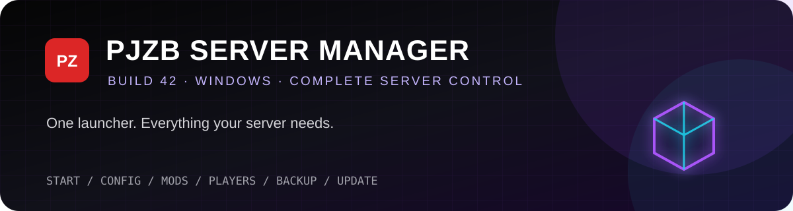

<div align="center">



### One launcher. Complete Project Zomboid server control.
### Launcher เดียว จัดการเซิร์ฟเวอร์ Project Zomboid ได้ครบทุกอย่าง

[](https://github.com/CommunityDevGitZ/PJZB-Server-Manager/releases/latest)
[](https://github.com/CommunityDevGitZ/PJZB-Server-Manager/releases)
👀 [](https://hits.sh/github.com/CommunityDevGitZ/PJZB-Server-Manager/)


**Self-contained Windows application — no .NET installation required**  
**โปรแกรม Windows แบบพร้อมใช้ — ไม่ต้องติดตั้ง .NET เพิ่ม**

[⬇️ Download Latest](https://github.com/CommunityDevGitZ/PJZB-Server-Manager/releases/latest) · [🇬🇧 English Manual](#english-manual) · [🇹🇭 คู่มือภาษาไทย](#คู่มือภาษาไทย) · [🐞 Report an Issue](https://github.com/CommunityDevGitZ/PJZB-Server-Manager/issues)

</div>

---

## Highlights / จุดเด่น

| Feature | English | ภาษาไทย |
|---|---|---|
| 🚀 First-Time Setup | Installs SteamCMD and the dedicated server automatically | ติดตั้ง SteamCMD และ Dedicated Server อัตโนมัติ |
| 🧭 Existing Server | Reuse an existing PJZB root without resetting data | นำ Server เดิมมาใช้โดยไม่รีเซ็ตข้อมูล |
| 🌐 Connection | Dedicated, Port Forward, and playit.gg | Dedicated, Forward Port และ playit.gg |
| 📊 Dashboard | Status, players, CPU, RAM, IP/Port, colored logs | สถานะ ผู้เล่น CPU, RAM, IP/Port และ Log แยกสี |
| ⚙️ Settings | Friendly Configuration and Sandbox editors | แก้ Configuration และ Sandbox ได้ง่าย |
| 🧩 Mods | Manage load order, dependencies, IDs, and updates | จัดการลำดับ Dependency, ID และอัปเดต |
| 👥 Players | RCON, access levels, kick, ban, and broadcast | RCON, ตั้งสิทธิ์, Kick, Ban และ Broadcast |
| 💾 Backups | Create, restore, and safely delete backups | สร้าง กู้คืน และลบ Backup อย่างปลอดภัย |
| 🧑‍💻 Dev Workspace | Create, edit, validate, move, back up, and delete server Lua files | สร้าง แก้ ตรวจ ย้าย สำรอง และลบไฟล์ Lua ใน Server |
| 🔔 System Tray | Keep the Launcher available after closing or minimizing | ซ่อน Launcher ไว้ที่มุมขวาล่างเมื่อปิดหรือย่อหน้าต่าง |

## Setup modes / รูปแบบการติดตั้ง

| Mode | Best for / เหมาะกับ | Requirements / สิ่งที่ต้องทำ |
|---|---|---|
| **Dedicated Server** | VPS, rented server, always-on PC / VPS เครื่องเช่า เครื่องแยก | Allow UDP `16261–16262`; a home router may still require port forwarding. |
| **Forward Port** | Home PC and lowest latency / เครื่องบ้านที่ต้องการ latency ต่ำ | Forward UDP `16261–16262` and allow them in Windows Firewall. Public IPv4 required. |
| **playit.gg — No Port Forward** | CGNAT or no router access / ติด CGNAT หรือเปิดพอร์ตไม่ได้ | Launcher installs the agent; owner claims it and creates a Project Zomboid tunnel. Players install nothing. |

> **Important:** Dedicated describes the machine role; it does not automatically bypass a router or CGNAT.  
> **สำคัญ:** Dedicated คือรูปแบบเครื่อง ไม่ได้ข้าม Router หรือ CGNAT อัตโนมัติ

---

# English Manual

## Contents

1. [Requirements](#requirements)
2. [Download and launch](#download-and-launch)
3. [First-Time Setup](#first-time-setup)
4. [Use an existing server](#use-an-existing-server)
5. [Network setup](#network-setup)
6. [Dashboard and control](#dashboard-and-control)
7. [Configuration and Sandbox](#configuration-and-sandbox)
8. [Mods and Workshop](#mods-and-workshop)
9. [Players and RCON](#players-and-rcon)
10. [Dev Workspace](#dev-workspace)
11. [Backups](#backups)
12. [Updates and Launcher Settings](#updates-and-launcher-settings)
13. [Troubleshooting](#troubleshooting)

## Requirements

- Windows 10/11, 64-bit
- Internet access and enough disk space for the server, Workshop items, saves, and backups
- Administrator permission may be required for Firewall/startup tasks
- A router/public-IP configuration appropriate for your connection mode

PJZB Server Manager is self-contained. No separate .NET runtime is required.

## Download and launch

1. Open [Latest Release](https://github.com/CommunityDevGitZ/PJZB-Server-Manager/releases/latest).
2. Download `PJZB.Server.Manager.exe`.
3. Put it in a dedicated folder such as `C:\PJZB` or `D:\Servers\PJZB`.
4. Run it. If SmartScreen appears, verify the source and choose **More info → Run anyway**.

> Do not use a drive root such as `C:\` as the Server root.

## First-Time Setup

When no compatible server is found, the Launcher opens First-Time Setup before the dashboard.

1. Select **Server installation path**.
2. Set **Maximum Java RAM** or keep the recommendation.
3. Select optional auto-start settings.
4. Press **FIRST-TIME SETUP**.
5. Choose Dedicated, Forward Port, or playit.gg.
6. Follow the progress window until completion.

The Launcher downloads SteamCMD, installs Project Zomboid Dedicated Server, creates folders/configuration, and prepares Admin/RCON credentials. Interrupted SteamCMD downloads are retained and retried up to four times. Configuration is generated automatically and remains editable later.

## Use an existing server

Choose **USE EXISTING SERVER** for a previously prepared PJZB root:

```text
PJZB\
├─ server\
│  └─ jre64-pjzb\bin\java.exe
│     or jre64\bin\java.exe
└─ data\
   └─ Server\PJZB.ini
```

The existing world, saves, player database, mods, and configuration stay in place and are not reset.

> A root containing only `servertest.ini` is not automatically renamed. Convert it to the PJZB layout first to avoid opening the wrong world/profile.

## Network setup

### Dedicated Server

- Best for a VPS, rented host, or separate always-on machine.
- Allow UDP `16261–16262` in Windows/provider firewall.
- Public Browser works when the server is reachable and `Public=true`.
- A home router may still require port forwarding.

### Forward Port

1. Reserve a stable LAN IP for the server PC.
2. Forward UDP `16261–16262` to that PC.
3. Allow the same ports in Windows Firewall.
4. Give players `Public IP:16261`.

Normal forwarding cannot work through CGNAT until the ISP supplies a reachable public IPv4.

### playit.gg — No Port Forward

The Launcher downloads and starts the agent and opens its Claim URL. The owner completes these one-time steps:

1. Sign in to [playit.gg](https://playit.gg/) and claim the agent.
2. Create a **Project Zomboid** tunnel.
3. Copy the numeric IP, main port, and server address into the Launcher.
4. Press **SAVE & CONTINUE**.

Players use the assigned address and disable **Use Steam Relay**. They do not install playit.gg.

- [Video guide](https://www.youtube.com/watch?v=ClPNlTIkYb0)
- [Official playit.gg guide](https://playit.gg/support/project-zomboid-steam-dedicated-server/)

## Dashboard and control

- **START** — start the server.
- **SAVE & STOP** — save and stop safely; use this instead of killing Java.
- **RESTART** — save, stop, and start again.
- **CHECK UPDATES** — check server and Workshop updates.

The Dashboard reports **OFFLINE**, **STARTING**, **ONLINE**, **STOPPING**, or **UPDATING**, plus players, CPU, Java RAM, IP/Port, and color-coded live logs. Search the current log text, enable **Follow latest** to stay on the newest line, or choose ALL, ERROR, WARNING, SUCCESS, NETWORK, LUA, INFO, or DEBUG to show only that category.

## Configuration and Sandbox

**Quick Setup** covers name, player limit, welcome message, PVP, PauseEmpty, Public Browser, and open accounts. **All Server Settings** provides search/categories for `PJZB.ini`. Apply the selected value and press **SAVE ALL CHANGES**.

Sandbox values from `PJZB_SandboxVars.lua` can be filtered as **ALL**, **BASE GAME**, or **MODS**. Press **SAVE SANDBOX** when finished. Many settings require a restart; back up before major changes.

## Mods and Workshop

The Mods page controls enabled items, load order, dependencies, Mod/Workshop IDs, and downloads. The Workshop page opens Project Zomboid Workshop inside the Launcher and adds/removes the current item from the server list.

> Stop the server before downloading/updating mods and verify dependencies before disabling a parent mod.

## Players and RCON

When the header reports **RCON ready**, you can refresh online players, change access level, kick/ban/unban, and broadcast messages. If players are online but the list is empty, verify RCON ready and press Refresh.

## Dev Workspace

The **Dev Workspace** tab scans editable Lua sources under Server configuration, custom mods, the server installation, and Workshop content. Runtime world data under `data\Saves` is deliberately excluded. It can search, create, edit files up to 128 MB, check, reload, rename/move, and send Lua files to the Recycle Bin. Every overwrite creates a timestamped recovery copy under `backups\dev-lua` and saving is blocked if another program changed the file after it was loaded.

The CHECK button detects encoding/null characters, merge-conflict markers, unclosed strings/comments, and mismatched brackets. It is a structural safety check, not a replacement for the Project Zomboid Lua runtime. Server/shared Lua changes normally require a server restart.

## Backups

- **CREATE BACKUP NOW** creates an archive.
- **RESTORE SELECTED** restores it while the server is stopped.
- **DELETE** moves it to the Windows Recycle Bin.

A safety backup of current data is created before restore.

## Updates and Launcher Settings

Configure auto-update interval, initial delay, player warnings, and retry cooldown. Updates are blocked while players are connected; use **UPDATE WHILE STOPPED** after Save & Stop.

The top-right gear opens Launcher Settings for Server root, Shared/Gaming or Dedicated mode, Java RAM, priority, startup options, Launcher updates, and copying the generated Admin password. A Launcher update does not stop a running Java server.

The **System tray** settings control whether Close or Minimize hides the Launcher in the Windows notification area, whether it starts hidden, and whether a tray notification is shown. Double-click the PZ icon to restore the window. Right-click it for Open, Start Server, Save & Stop, Restart, and Exit Launcher. **Exit Launcher** closes only the manager; it does not stop the Java server.

## Troubleshooting

<details><summary><strong>SteamCMD stays at 0% or setup fails</strong></summary>

- Check Internet access, disk space, antivirus, and Firewall.
- Run setup again at the same path; downloaded data is reused.
- Use **COPY ERROR** when reporting the problem.
</details>

<details><summary><strong>Online but players cannot connect</strong></summary>

- Forward Port: check UDP `16261–16262`, Firewall, router destination IP, and CGNAT.
- playit.gg: check agent/tunnel status and assigned ports; clients disable Use Steam Relay.
- Confirm compatible game, server, and mod versions.
</details>

<details><summary><strong>Server is missing from Public Browser</strong></summary>

Set `Public=true` and `PublicName`. Public Browser is best suited to Dedicated/Forward Port. A listing does not prove the ports are reachable.
</details>

<details><summary><strong>Launcher runs but no window appears</strong></summary>

Close duplicate `PJZB Server Manager.exe` processes in Task Manager and launch the latest version again.
</details>

---

# คู่มือภาษาไทย

## สารบัญภาษาไทย

1. [สิ่งที่ต้องมี](#สิ่งที่ต้องมี)
2. [ดาวน์โหลดและเปิดใช้งาน](#ดาวน์โหลดและเปิดใช้งาน)
3. [การติดตั้งครั้งแรก](#การติดตั้งครั้งแรก)
4. [ใช้เซิร์ฟเวอร์เดิม](#ใช้เซิร์ฟเวอร์เดิม)
5. [ตั้งค่าเครือข่าย](#ตั้งค่าเครือข่าย)
6. [Dashboard และควบคุม Server](#dashboard-และควบคุม-server)
7. [ตั้งค่า Configuration และ Sandbox](#ตั้งค่า-configuration-และ-sandbox)
8. [จัดการ Mods และ Workshop](#จัดการ-mods-และ-workshop)
9. [ผู้เล่นและ RCON](#ผู้เล่นและ-rcon)
10. [Dev Workspace](#dev-workspace-1)
11. [Backup และ Restore](#backup-และ-restore)
12. [Updates และ Launcher Settings](#updates-และ-launcher-settings-1)
13. [แก้ปัญหา](#แก้ปัญหา)

## สิ่งที่ต้องมี

- Windows 10/11 แบบ 64-bit
- อินเทอร์เน็ตและพื้นที่ว่างสำหรับ Server, Workshop, Save และ Backup
- อาจต้องใช้สิทธิ์ Administrator สำหรับ Firewall/การเปิดอัตโนมัติ
- ตั้งค่า Router หรือ Public IP ให้เหมาะกับโหมดเชื่อมต่อ

โปรแกรมเป็น Self-contained ไม่ต้องติดตั้ง .NET Runtime เพิ่ม

## ดาวน์โหลดและเปิดใช้งาน

1. เปิดหน้า [ดาวน์โหลดรุ่นล่าสุด](https://github.com/CommunityDevGitZ/PJZB-Server-Manager/releases/latest)
2. ดาวน์โหลด `PJZB.Server.Manager.exe`
3. วางในโฟลเดอร์เฉพาะ เช่น `C:\PJZB` หรือ `D:\Servers\PJZB`
4. เปิดโปรแกรม หาก SmartScreen เตือน ให้ตรวจที่มาแล้วเลือก **More info → Run anyway**

> ไม่ควรใช้ Root ของไดรฟ์ เช่น `C:\` เป็น Server root

## การติดตั้งครั้งแรก

เมื่อยังไม่พบ Server ที่ใช้งานได้ Launcher จะเปิด First-Time Setup ก่อน Dashboard

1. เลือก **Server installation path**
2. ตั้ง **Maximum Java RAM** หรือใช้ค่าที่แนะนำ
3. เลือก Auto Start ตามต้องการ
4. กด **FIRST-TIME SETUP**
5. เลือก Dedicated, Forward Port หรือ playit.gg
6. รอหน้าต่างสถานะจนเสร็จ

Launcher จะดาวน์โหลด SteamCMD, ติดตั้ง Dedicated Server, สร้างโฟลเดอร์/Configuration และเตรียม Admin/RCON password อัตโนมัติ หากเน็ตสะดุด ระบบเก็บข้อมูลเดิมและลองใหม่สูงสุด 4 ครั้ง หลัง Setup สามารถกลับมาแก้ Configuration ได้

## ใช้เซิร์ฟเวอร์เดิม

เลือก **USE EXISTING SERVER** เมื่อมี PJZB Server root ตามโครงสร้างนี้:

```text
PJZB\
├─ server\
│  └─ jre64-pjzb\bin\java.exe
│     หรือ jre64\bin\java.exe
└─ data\
   └─ Server\PJZB.ini
```

World, Save, ข้อมูลผู้เล่น, Mods และ Configuration เดิมจะไม่ถูกคัดลอกหรือรีเซ็ต

> หากมีเฉพาะ `servertest.ini` ระบบจะไม่เปลี่ยนเป็น `PJZB.ini` อัตโนมัติ ต้องแปลงโครงสร้างก่อนเพื่อป้องกันการเปิดผิด World

## ตั้งค่าเครือข่าย

### Dedicated Server

- เหมาะกับ VPS, เครื่องเช่า หรือเครื่องแยกที่เปิดตลอด
- อนุญาต UDP `16261–16262` ใน Firewall
- Public Browser ใช้ได้เมื่อเข้าถึงจากภายนอกได้และตั้ง `Public=true`
- เครื่องหลัง Router บ้านอาจยังต้อง Forward Port

### Forward Port

1. ล็อก LAN IP ของเครื่อง Server ให้คงที่
2. Forward UDP `16261–16262` จาก Router มาที่เครื่อง
3. อนุญาตพอร์ตเดียวกันใน Windows Firewall
4. ให้ผู้เล่นเข้า `Public IP:16261`

หากติด CGNAT จะ Forward Port ไม่ได้จนกว่า ISP จะให้ Public IPv4

### playit.gg — No Port Forward

Launcher ดาวน์โหลด/เปิด Agent และ Claim URL ให้ เจ้าของทำครั้งแรก:

1. เข้าสู่ระบบ [playit.gg](https://playit.gg/) และ Claim agent
2. สร้าง Tunnel ประเภท **Project Zomboid**
3. นำ Numeric IP, Main Port และ Server Address มากรอก
4. กด **SAVE & CONTINUE**

ผู้เล่นใช้ Address ที่ได้รับและปิด **Use Steam Relay** โดยไม่ต้องติดตั้ง playit.gg

- [คลิปสอน](https://www.youtube.com/watch?v=ClPNlTIkYb0)
- [คู่มือ playit.gg](https://playit.gg/support/project-zomboid-steam-dedicated-server/)

## Dashboard และควบคุม Server

- **START** — เปิด Server
- **SAVE & STOP** — บันทึกแล้วปิดอย่างปลอดภัย ควรใช้แทนการ Kill Java
- **RESTART** — บันทึก ปิด และเปิดใหม่
- **CHECK UPDATES** — ตรวจ Server/Workshop updates

Dashboard แสดง **OFFLINE**, **STARTING**, **ONLINE**, **STOPPING** หรือ **UPDATING** พร้อมผู้เล่น CPU, Java RAM, IP/Port และ Live Log แยกสี สามารถค้นหาข้อความ เปิด **Follow latest** เพื่อตามบรรทัดล่าสุด หรือเลือก ALL, ERROR, WARNING, SUCCESS, NETWORK, LUA, INFO และ DEBUG เพื่อแสดงเฉพาะประเภทนั้น

## ตั้งค่า Configuration และ Sandbox

**Quick Setup** แก้ชื่อ Server, จำนวนผู้เล่น, ข้อความต้อนรับ, PVP, PauseEmpty, Public Browser และ Open Account ส่วน **All Server Settings** ใช้ค้นหา/แก้ทุกค่าใน `PJZB.ini` จากนั้นกด Apply และ **SAVE ALL CHANGES**

หน้า Sandbox กรองค่าเป็น **ALL**, **BASE GAME** หรือ **MODS** และบันทึกลง `PJZB_SandboxVars.lua` ด้วย **SAVE SANDBOX** หลายค่าต้อง Restart ควร Backup ก่อนแก้จำนวนมาก

## จัดการ Mods และ Workshop

หน้า Mods ใช้เปิด/ปิด เปลี่ยนลำดับโหลด เพิ่ม Dependency, Mod ID/Workshop ID และดาวน์โหลดอัปเดต หน้า Workshop เปิด Workshop ใน Launcher และเพิ่ม/ลบ Item ปัจจุบันจากรายการ Server

> หยุด Server ก่อนดาวน์โหลด/อัปเดต Mods และตรวจ Dependency ก่อนปิด Mod หลัก

## ผู้เล่นและ RCON

เมื่อขึ้น **RCON ready** สามารถ Refresh ผู้เล่น เปลี่ยน Access Level, Kick, Ban, Unban และ Broadcast หากรายชื่อว่างทั้งที่มีผู้เล่น ให้ตรวจ RCON แล้วกด Refresh

## Dev Workspace

แท็บ **Dev Workspace** ค้นหา Source Lua จาก Server configuration, Custom mods, ตัวติดตั้ง Server และ Workshop โดยไม่รวมข้อมูล World ภายใน `data\Saves` สามารถค้นหา สร้าง เปิดไฟล์ขนาดไม่เกิน 128 MB แก้ไข ตรวจ Reload เปลี่ยนชื่อ/ย้าย และส่งไฟล์ไป Recycle Bin ได้ ทุกครั้งที่เขียนทับ ระบบจะสร้าง Recovery copy แบบมีเวลาไว้ใน `backups\dev-lua` และจะไม่ยอม Save หากไฟล์ถูกโปรแกรมอื่นแก้หลังจากเปิดเข้ามา

ปุ่ม CHECK ตรวจ NUL/Encoding, Merge conflict, String/Comment ที่ปิดไม่ครบ และวงเล็บไม่ตรงกัน เป็นการตรวจโครงสร้างเบื้องต้นเท่านั้น การเปลี่ยน Server/Shared Lua ตามปกติต้อง Restart Server

## Backup และ Restore

- **CREATE BACKUP NOW** — สร้าง Backup
- **RESTORE SELECTED** — กู้คืน โดยต้องหยุด Server ก่อน
- **DELETE** — ย้ายไฟล์ไป Recycle Bin

ระบบสร้าง Safety Backup ของข้อมูลปัจจุบันก่อน Restore

## Updates และ Launcher Settings

ตั้ง Auto Update interval, initial delay, player warning และ retry cooldown ได้ ระบบจะไม่อัปเดตขณะมีผู้เล่น ใช้ **UPDATE WHILE STOPPED** หลัง Save & Stop

ไอคอนเฟืองมุมขวาบนใช้เปลี่ยน Server root, โหมด Shared/Gaming หรือ Dedicated, Java RAM, priority, Auto Start, อัปเดต Launcher และคัดลอก Admin password การอัปเดต Launcher จะไม่ปิด Java Server ที่กำลังทำงาน

ส่วน **System tray** ตั้งได้ว่าปุ่มกากบาทหรือปุ่มย่อจะซ่อน Launcher ไปยัง Notification area หรือไม่, ให้เปิดแบบซ่อนตั้งแต่เริ่ม และให้แสดงการแจ้งเตือนหรือไม่ ดับเบิลคลิกไอคอน PZ เพื่อเปิดหน้าต่าง หรือคลิกขวาเพื่อ Open, Start Server, Save & Stop, Restart และ Exit Launcher การเลือก **Exit Launcher** จะปิดเฉพาะโปรแกรมจัดการ ไม่ปิด Java Server

## แก้ปัญหา

<details><summary><strong>SteamCMD ค้าง 0% หรือ Setup Failed</strong></summary>

- ตรวจอินเทอร์เน็ต พื้นที่ว่าง Antivirus และ Firewall
- Setup ซ้ำที่ path เดิม ระบบจะใช้ไฟล์ที่โหลดไว้ต่อ
- ใช้ **COPY ERROR** เมื่อต้องการแจ้งปัญหา
</details>

<details><summary><strong>Server Online แต่ผู้เล่นเข้าไม่ได้</strong></summary>

- Forward Port: ตรวจ UDP `16261–16262`, Firewall, IP ใน Router และ CGNAT
- playit.gg: ตรวจ Agent/Tunnel และพอร์ต ให้ผู้เล่นปิด Use Steam Relay
- ตรวจ Game, Server และ Mod version ให้เข้ากัน
</details>

<details><summary><strong>ไม่แสดงใน Public Browser</strong></summary>

ตั้ง `Public=true` และ `PublicName` เหมาะกับ Dedicated/Forward Port มากกว่า playit.gg และการแสดงชื่อไม่ได้ยืนยันว่าเปิดพอร์ตถูกต้อง
</details>

<details><summary><strong>Launcher ทำงานแต่ไม่เห็นหน้าต่าง</strong></summary>

ปิด `PJZB Server Manager.exe` ที่ซ้ำใน Task Manager แล้วเปิดรุ่นล่าสุดอีกครั้ง
</details>

---

## Security / ความปลอดภัย

- Never publish Admin/RCON passwords or `manager-settings.json`. / ห้ามเผยแพร่ Admin/RCON password หรือ `manager-settings.json`
- Use a password or whitelist for private servers. / ใช้ Password หรือ Whitelist สำหรับ Private Server
- Back up before major mod, map, or Sandbox changes. / Backup ก่อนแก้ Mods, Maps หรือ Sandbox จำนวนมาก
- Use **SAVE & STOP** before Windows shutdown or restore. / ใช้ **SAVE & STOP** ก่อนปิด Windows หรือ Restore

<div align="center">

---

[Download Latest](https://github.com/CommunityDevGitZ/PJZB-Server-Manager/releases/latest) · [Project Zomboid Workshop](https://steamcommunity.com/app/108600/workshop/) · [Report an Issue](https://github.com/CommunityDevGitZ/PJZB-Server-Manager/issues)

PJZB Server Manager is a community project and is not affiliated with The Indie Stone, Valve, or playit.gg.  
PJZB Server Manager เป็นโครงการจากชุมชน ไม่ใช่ผลิตภัณฑ์อย่างเป็นทางการของ The Indie Stone, Valve หรือ playit.gg

</div>
